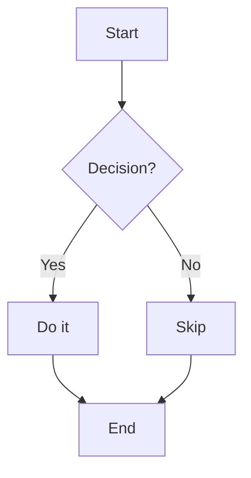
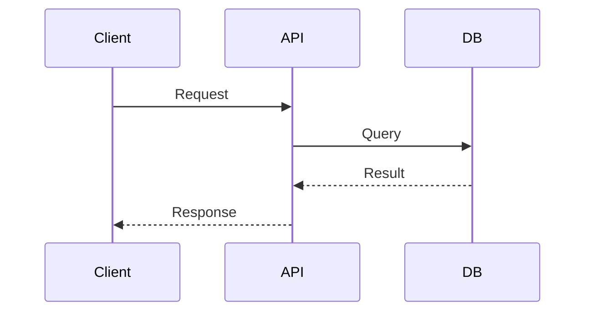
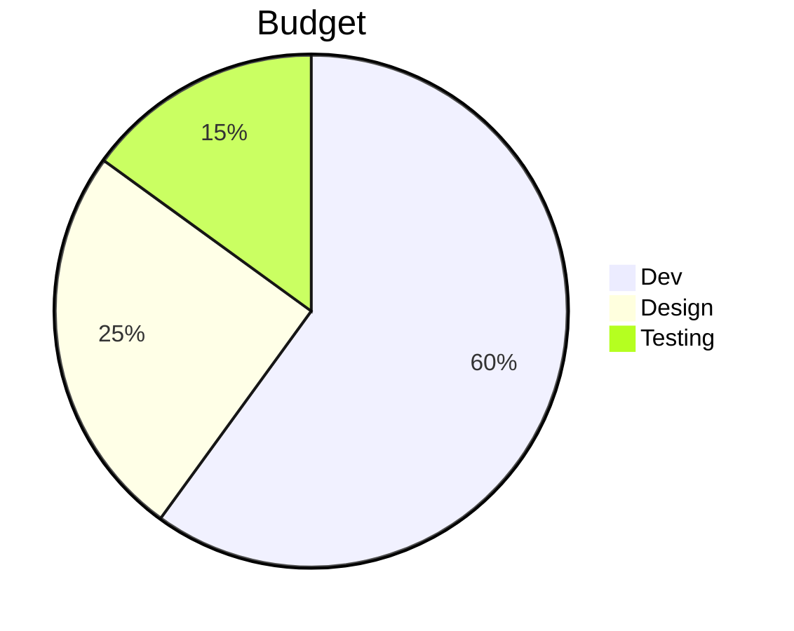

# PPTAutomation — Syntax & Features SOP

---

## Table of Contents

1. How the App Works
2. Markdown Syntax Reference
3. AsciiDoc Syntax Reference
4. Slide Directives (Controls)
5. Vertical Slides (Overflow Content)
6. Animations & Fragments
7. Media — Images, Video, Diagrams
8. Callouts & Blockquotes
9. Tables & Code Blocks
10. GitLab Import — Step by Step
11. Insert Media — Step by Step
12. Whiteboard — Step by Step
13. Export — Step by Step
14. Keyboard Shortcuts

---

## 1. How the App Works

The app converts text (Markdown or AsciiDoc) into a Reveal.js slide presentation.

**Pipeline:**

```
.md / .adoc file
      ↓
   Parser
      ↓
  Slide objects
      ↓
  Reveal.js HTML
      ↓
  Export / Present
```

**Rules:**
- Each `#` heading (H1 or H2) starts a **new slide**
- H3–H6 headings are rendered **inside** the current slide
- Content before the first heading is ignored
- Everything between two headings is the body of one slide

---

## 2. Markdown Syntax Reference

### Slides

```markdown
# Slide Title          ← starts a new horizontal slide (H1)

## Another Slide       ← also starts a new slide (H2)

### Section Inside     ← rendered INSIDE current slide (H3)
```

### Text & Inline Formatting

```markdown
Normal paragraph text.

**bold text**
_italic text_
`inline code`
~~strikethrough~~
```

### Lists

```markdown
- Bullet item
- Another item
  - Nested item (2 spaces indent)
    - Deeper nest

1. Ordered item
2. Second item
   1. Nested ordered
```

### Horizontal Divider

```markdown
---
```
Renders as a styled `<hr>` line inside a slide.

### Links

```markdown
[Link Text](https://example.com)
```

---

## 3. AsciiDoc Syntax Reference

### Headings

```asciidoc
= Document Title      ← H1 (new slide)
== Chapter            ← H2 (new slide)
=== Section           ← H3 (inside slide)
==== Subsection       ← H4 (inside slide)
```

### Text Formatting

```asciidoc
*bold text*
_italic text_
+monospace+
`backtick code`
```

### Lists

```asciidoc
* Unordered item
** Nested item (two stars)
*** Deeper level

. Ordered item
.. Nested ordered
... Third level
```

### Links & Images

```asciidoc
link:https://example.com[Link Label]

image::path/to/image.png[Alt Text]
image:path/inline.png[Alt]          ← inline image
```

### Code Blocks

```asciidoc
[source,python]
----
def hello():
    print("Hello World")
----

[source,javascript]
----
const x = 42;
----
```

### Admonitions (Callouts)

```asciidoc
NOTE: This is a note callout.

TIP: A helpful tip for the reader.

WARNING: Be careful about this.

IMPORTANT: Critical information.

CAUTION: Proceed with caution.
```

Block style (multi-line):

```asciidoc
[NOTE]
====
This is a multi-line note.
It can span many lines.
====
```

### Tables

```asciidoc
|===
| Column A | Column B | Column C

| Row 1A   | Row 1B   | Row 1C
| Row 2A   | Row 2B   | Row 2C
|===
```

### Quote Block

```asciidoc
____
This text appears as a blockquote.
— Author Name
____
```

### Sidebar / Example Blocks

```asciidoc
****
Sidebar content here.
Content is kept and rendered normally.
****

====
Example block content.
====
```

### Horizontal Rule

```asciidoc
'''
```

### Comments (Stripped from Output)

```asciidoc
// Single-line comment — ignored

////
Multi-line comment block.
Everything here is ignored.
////
```

### Page Break → Vertical Slide

```asciidoc
<<<
```
Creates a **vertical sub-slide** (navigate with ↓ arrow).

---

## 4. Slide Directives (Controls)

Directives are HTML comments placed inside a slide body.
They control per-slide behaviour without appearing in output.

### Syntax

```markdown
<!-- key: value -->
```

### Available Directives

| Directive | Values | Effect |
|---|---|---|
| `layout` | `cover`, `default`, `section`, `two-column`, `image-left`, `image-right`, `blank` | Forces a specific layout |
| `background` | Any CSS colour (`#ff0000`, `navy`, `rgba(...)`) | Sets slide background colour |
| `transition` | `none`, `fade`, `slide`, `convex`, `concave`, `zoom` | Per-slide transition override |
| `notes` | Any text | Speaker notes (press S in presentation) |
| `tags` | `tag1,tag2` | Metadata tags |
| `auto-advance` | `3000` (milliseconds) | Auto-advance after N ms |
| `animation` | `fade`, `slide-up`, `slide-down`, `zoom` | Entrance animation for first element |

### Examples

```markdown
# My Cover Slide

<!-- layout: cover -->
<!-- background: #1a1a2e -->
<!-- transition: zoom -->
<!-- notes: Talk about the project goals here. -->

Welcome to our presentation.
```

---

## 5. Vertical Slides (Overflow / Extended Content)

When a slide has too much content, split it into **vertical sub-slides**.
Navigate between them with the **↓ / ↑ arrow** in presentation mode.

A small **↓N** badge appears on the slide thumbnail when vertical slides exist.

### In Markdown

```markdown
## Chapter 1 — Main Concepts

This content is on the first (top) slide.

<!-- vertical -->

This content is on the second slide (press ↓).

<!-- vertical -->

This content is on the third slide (press ↓ again).
```

### In AsciiDoc

```asciidoc
== Chapter 1 — Main Concepts

This content is on the first slide.

<<<

This content is on the second slide (press ↓).

<<<

This is the third vertical slide.
```

### Rules

- `<<<` in AsciiDoc and `<!-- vertical -->` in Markdown are equivalent
- Vertical slides belong to the same horizontal position
- Press **→** to advance to the next chapter/topic
- Press **↓** to go deeper within the current topic

---

## 6. Animations & Fragments

### Per-Element Entrance Animation

Place the comment **immediately before** the element to animate:

```markdown
<!-- @animate fade -->
- This bullet appears with a fade

<!-- @animate slide-up -->
## This heading slides up

<!-- @animate zoom -->

```

### Available Effects

| Effect | Description |
|---|---|
| `fade` | Fade in from transparent |
| `slide-up` | Slide in from below |
| `slide-down` | Slide in from above |
| `slide-left` | Slide in from right |
| `slide-right` | Slide in from left |
| `zoom` | Zoom in from small |
| `zoom-out` | Zoom in from large |
| `bounce` | Bounce in |

### Slide-Level Animation (via Directive)

Applies the animation to the **first element** of the slide:

```markdown
# Animated Slide

<!-- animation: slide-up -->

This paragraph will slide up when the slide appears.
```

---

## 7. Media — Images, Video, Diagrams

### Images (Markdown)

```markdown


```

### Images (AsciiDoc)

```asciidoc
image::https://example.com/photo.jpg[Photo description]
image::./assets/logo.png[Company Logo]
```

### YouTube / Vimeo Video

```markdown
[Watch this video](https://www.youtube.com/watch?v=VIDEO_ID)
[Vimeo](https://vimeo.com/123456789)
```

### Local Video

```markdown
<video src="./assets/demo.mp4" controls></video>
```

### Iframe Embed

```markdown
<iframe src="https://example.com/interactive"></iframe>
```

### Mermaid Diagrams

Wrap Mermaid source in a fenced code block with language `mermaid`:

````markdown

````

````markdown

````

````markdown

````

**Supported diagram types:** flowchart, sequence, pie, class, state, gitGraph, gantt, mindmap, ER

---

## 8. Callouts & Blockquotes

### Markdown Blockquote → Callout

```markdown
> Normal blockquote — renders as an info callout.

> [!NOTE]
> This is a note callout with a label.

> [!TIP]
> A helpful tip for the audience.

> [!WARNING]
> Something to be careful about.

> [!CAUTION]
> Serious warning content.
```

### Callout Variants

| Variant | Icon | Border |
|---|---|---|
| `note` | 📝 | Grey |
| `info` | ℹ️ | Blue |
| `tip` | 💡 | Accent |
| `warning` | ⚠️ | Yellow |
| `danger` | 🚫 | Red |
| `success` | ✅ | Green |

---

## 9. Tables & Code Blocks

### Markdown Table

```markdown
| Feature   | Status | Notes          |
|-----------|--------|----------------|
| Import MD | ✅     | Fully working  |
| Import ADOC | ✅   | GitLab + local |
| Export HTML | ✅   | Single file    |
| Export PPTX | 🔜   | CLI only       |
```

### Code Block (Markdown)

````markdown
```python
def greet(name: str) -> str:
    return f"Hello, {name}!"
```

```javascript
const sum = (a, b) => a + b;
```

```bash
npm install && npm run dev
```
````

**Any language tag works** — syntax highlighting is handled by highlight.js.

---

## 10. GitLab Import — Step by Step

**Purpose:** Pull `.md` or `.adoc` files from a GitLab repository and convert them into a presentation.

### Steps

1. Click **GitLab** in the toolbar (top right)
2. Fill in the connection form:
   - **GitLab URL** — e.g. `https://gitlab.com` or your self-hosted URL
   - **Access Token** — Personal Access Token with `read_repository` scope
   - **Project ID** — numeric ID or `namespace/project-name`
   - **Branch** — e.g. `main`
   - **Work Directory** — folder path to list files from (e.g. `docs/slides`)
3. Click **Connect**
4. Files appear grouped by folder (Chapter 1, Chapter 2, etc.)
5. Check the files you want — **folder checkbox selects all files** in that folder
6. Multiple `.adoc` files in the same folder are combined into one presentation
7. Click **Import X Files** (button shows count)
8. The presentation is built and loaded into the editor

### Notes

- `.adoc` files are converted via the AsciiDoc pipeline automatically
- `.md` files are imported as-is
- All selected files are fetched in parallel and merged before parsing
- Headings become slide boundaries as normal

---

## 11. Insert Media — Step by Step

Click **Insert** in the toolbar to open the media modal.

### Image Tab

1. Paste a URL or click **Browse** to pick a local file
2. Fill in **Alt text** and optional **Caption**
3. Click **Insert Image**
4. Image appears in the current slide — drag/resize on canvas in Edit mode

### Video Tab

1. Paste a YouTube / Vimeo URL **or** pick a local `.mp4` file
2. Click **Insert Video**

### SVG / Embed Tab

1. Paste an SVG URL or any iframe URL (CodePen, Figma, etc.)
2. Click **Insert Media**

### Diagram Tab

1. Pick a **Quick Start Preset** (Flowchart, Sequence, Pie, Class, State, Git Graph)
2. Edit the **Mermaid source** in the text area
3. Choose **Theme** (Dark / Default / Forest / Neutral)
4. Optionally toggle **Step Animation** (nodes appear one at a time)
5. Click **Insert Diagram**

### HTML / 3D Tab

**Purpose:** Embed a self-contained `.html` file (Three.js, Babylon.js, WebGL, Spline, etc.)

1. Click **Browse .html file** and pick your HTML file
   - OR paste an external URL in the URL field
2. Click **Insert HTML Embed**
3. The file runs inside a full-slide sandboxed iframe — scripts and WebGL are enabled
4. Resize on the canvas using drag handles in Edit mode

### Whiteboard Tab

1. Click the **Whiteboard ✏️** tab
2. Click **✏️ Add Whiteboard**
3. The whiteboard element appears on the slide
4. **Double-click** it (or click **Edit Whiteboard** when selected) to open the drawing editor
5. Draw freely using tldraw tools
6. Click **✓ Done** to save — the drawing is stored in the element and exported as SVG

---

## 12. Whiteboard — Step by Step

### Opening the Editor

- **Double-click** the whiteboard element on the canvas
- OR click the element once (select it), then click **✏️ Edit Whiteboard**

### Drawing Tools (tldraw)

| Tool | Shortcut | Use |
|---|---|---|
| Select | V | Move / resize shapes |
| Draw | D | Freehand drawing |
| Arrow | A | Connect shapes |
| Text | T | Add text labels |
| Sticky Note | N | Coloured sticky notes |
| Rectangle | R | Boxes / containers |
| Ellipse | O | Circles / ovals |
| Eraser | E | Remove shapes |

### Saving

- Click **✓ Done** in the top-right header bar
- The drawing is saved as an SVG snapshot into the slide element
- The SVG is shown as a preview on the slide canvas
- When you export HTML, the SVG is embedded as an `` tag

### Discarding Changes

- Click **Cancel** — closes without saving, previous drawing is preserved

---

## 13. Export — Step by Step

### Export HTML (Single File)

1. Click **Export HTML** in the toolbar
2. A single `.html` file is downloaded
3. Open it in any browser — no internet required (all assets embedded)
4. Includes full Reveal.js presentation with navigation, animations, diagrams

### Export ZIP

1. Click **ZIP** in the toolbar
2. A `.zip` archive is downloaded with:
   - `index.html` — main presentation file
   - `assets/` — vendor JS/CSS files (offline capable)

### Present Mode

1. Click **Present** in the toolbar
2. Enters fullscreen Reveal.js presentation
3. Use keyboard controls:

| Key | Action |
|---|---|
| `→` / `Space` | Next slide |
| `←` | Previous slide |
| `↓` | Next vertical slide |
| `↑` | Previous vertical slide |
| `F` | Fullscreen |
| `S` | Speaker notes |
| `O` | Slide overview |
| `Esc` | Exit overview / fullscreen |
| `B` | Black screen pause |

---

## 14. Keyboard Shortcuts

### Editor

| Shortcut | Action |
|---|---|
| `Ctrl+S` | Save presentation |
| Double-click element | Edit text / open whiteboard |
| Drag element | Reposition on canvas (Edit mode) |
| Drag corner handle | Resize element (Edit mode) |

### Presentation Mode

| Key | Action |
|---|---|
| `→` `Space` | Advance |
| `←` | Back |
| `↓` | Down (vertical slide) |
| `↑` | Up (vertical slide) |
| `Home` | First slide |
| `End` | Last slide |
| `S` | Speaker notes panel |
| `O` | Slide overview grid |
| `F` | Fullscreen |
| `B` or `.` | Pause (black screen) |
| `Esc` | Exit fullscreen / overview |

---

## Quick Reference Card

```
NEW SLIDE          # Heading  or  ## Heading
VERTICAL SLIDE     <!-- vertical -->  or  <<< (adoc)
CALLOUT            > [!NOTE]  /  > [!WARNING]  /  > [!TIP]
CODE BLOCK         ```language ... ```
MERMAID DIAGRAM    ```mermaid ... ```
IMAGE              
VIDEO              [label](youtube-url)
ANIMATION          <!-- @animate fade -->  (before element)
LAYOUT             <!-- layout: cover -->
BACKGROUND         <!-- background: #1a1a2e -->
SPEAKER NOTES      <!-- notes: Your notes here -->
PAGE BREAK (adoc)  <<<
HORIZONTAL RULE    ---  (md)   '''  (adoc)
```
